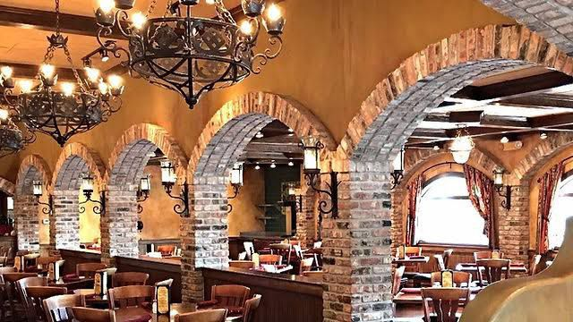
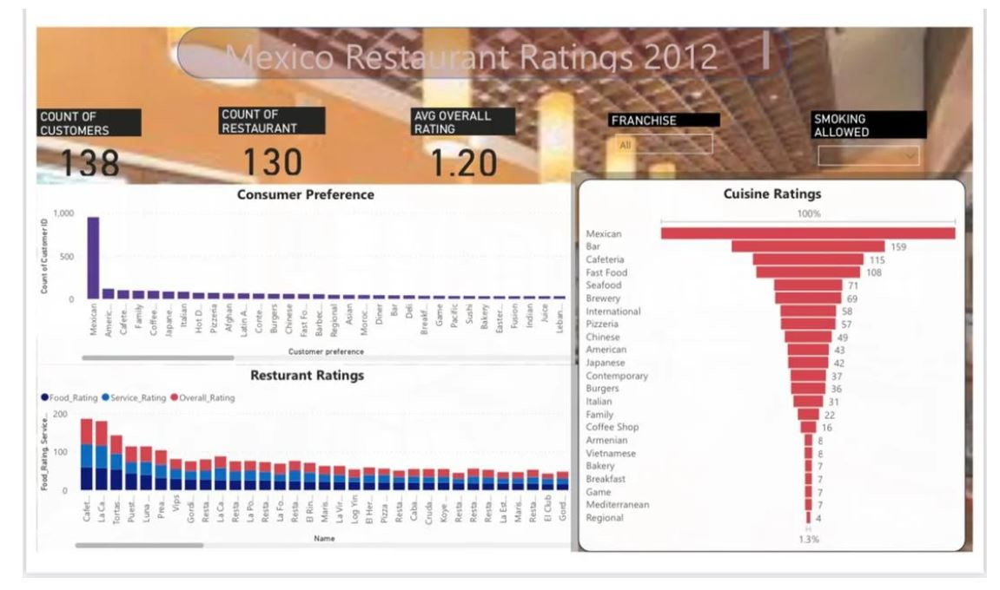
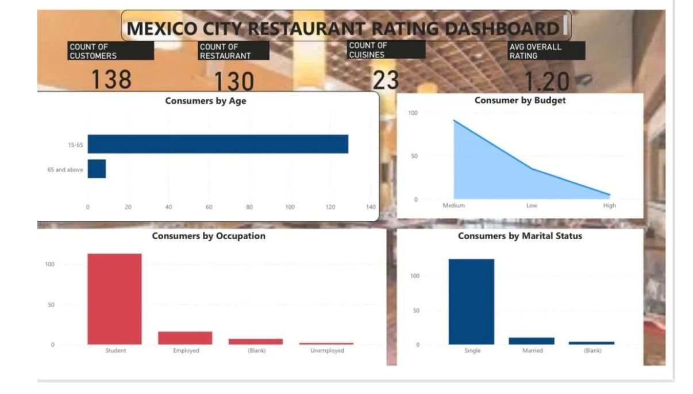
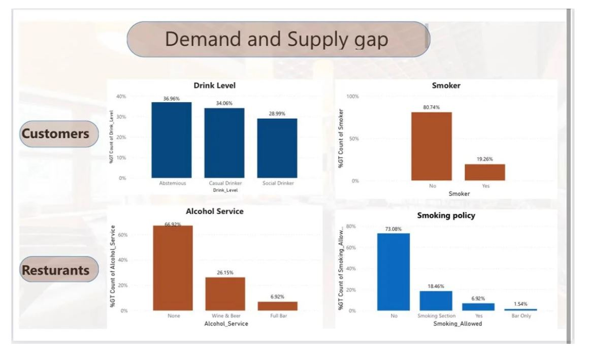

# Mexican Resturant Business/Investment Case Study

## Introduction:

- Anonymous A is trying to venture into a new business in Mexico. We want to see how favourable the restaurant market is in Mexico and look out for possible business opportunities.
- Anonymous B needs to Invest and has asked for insights to validate his investment decisions.
**Notably:** In this case study, I used survey data to evaluate some key indicators in the restaurant market and with this, I was able to point out business and investment opportunities.

## Problem statement:

1. What are the highest & Lowest rated restaurants?
2. What is the highest rated cuisine? 
3. What are the consumers' preferences?
4. What are consumer demographics? 
5. Are there any demand-Supply gaps in the market? 
6. Are there any Investment options available for investors?
7. Are there any business opportunities for entrepreneurs?

## Skills/Concepts demonstrated:

The following Power BI features and skills were incorporated
- Data Cleaning and Transformation
- Modelling
- Exploratory Data Analysis
- Data Visualization
- Problem Solving

## Tool Used
- Power BI

## Visualization:

The report comprises 5 key insights:
1. Highest & Lowest rated restaurants.
2. Highest rated cuisine. 
3. Consumer preference. 
4. Consumer demographics.
5. Demand-Supply gaps in the market. 

### Highest & Lowest rated restaurants:
---

#### Analysis:
The cafeterias had thehighest rarings which was further broken down into food ratings, service raring, and overall rating. With that still, cafeteria had the highest rating for each category.
The lowest rated was Gord

### Highest rated cuisine:
---

#### Analysis
Mexican cuisine was the highest rated cuisine.

### Consumer preference:
---

#### Analysis:
It was noted that most people preffered the Mexican cuisine, apart from it being the most rated.

### Consumer demographics:
---

#### Analysis:
The customer demograohics showed that:
- Most of the customers were medium income earners, and only about 5% were high income earners.
- Most of the customers were single which i found very wierd because i expected people to come with their spouses 😄
- It showed that most of the customers were students which i think now explains why they are single.
- It also showed that most of the customers fell within the age bracket of 15-65. However, if we were to have broken the age bin further, it would have been clear that the - age group would have fallen between 15-28 because most of the customers were students.

performing states are Maine, West Virginia,South Dakota amd North Dakota which recorded $1k sales respectively

### Demand-Supply gaps in the market:
---

#### Analysis:
It showed that about 64% of the customers are drinkers and enjoy drinking,butthere are relatively 32% resturant coverage for that demand.

## Conclusion and Key notable point:
- Demand-supply gap exist due to relatively low supply of alcohol.
- Non-franchise company have better rating.
- Mexican cuisine were better rated.
- Entrepreneurs seeking to explore that market need to pay attention to the non-franchise market dominance.
- Entrepreneurs can also take advantage of the demand-supply gap.

## Recommendations:

### Business opportunity:

- Restaurants that sell cuisine are restaurants that have market dominance. Therefore, anonymous A can be advised to sell cuisine.
- Restaurants that have a policy of a separate smoking section or no smoking section at all seem to be a frontline.
- With the age group (15-65) having a higher budget, it is best to focus marketing on them as they are in the best position and have the resources to buy the product/service. 

### Investment opportunity:
- It shows that the best investment decision to take is by investing in a non-franchise restaurant.

